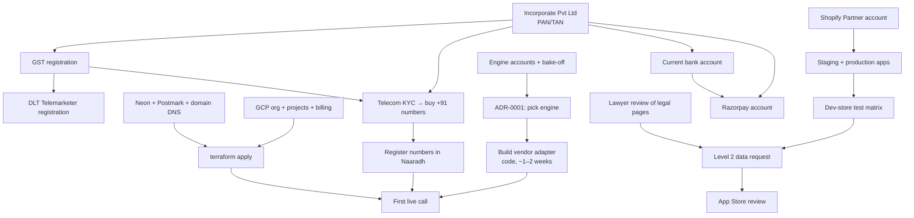

# Go-live guide — everything Naaradh needs from outside the code

**Audience:** the founder (and anyone helping) turning the built product into live calls.
**Date:** 13 Sep 2026. **Source of truth for rules:** `docs/NAARADH_BUILD_SPEC.md`; for plan and
status: `PLAN.md` and `docs/phase-reviews/`. This guide collects, in one place, every account,
registration, number, key and approval the code depends on, in the order to get them.

> The software for Phases 1 and 2 is built and tested on a simulated voice engine. **No real call
> can happen until the items below exist** — most of them have lead times of days to weeks, and
> several depend on the company being incorporated first. Start the long ones now.

## Where things stand (checked 13 Sep 2026)

| Area | State | Blocks live calls? |
|---|---|---|
| Call pipeline, compliance gate, inbound agent runtime, billing, dashboards, Shopify app, staff console, Phase 3 hardening (`docs/phase-reviews/phase-3.md`) | Built and tested locally; all 7 services build | — |
| Voice engine adapter (Bolna / OmniDimension / Retell) | **Not built** — deliberately waits for the bake-off (ADR-0001). Only the simulator works today | **Yes** |
| Phone numbers (+91) | None. Needs the entity (KYC) and an answer on the number series (Q-01) | **Yes** |
| Company (Pvt Ltd), GST, bank account | In progress | **Yes** — needed for numbers, DLT, Razorpay, payouts |
| DLT telemarketer registration | Not started (needs GST) | Yes for promotional; ask TSPs about transactional (Q-01/Q-02) |
| Shopify apps (staging + production) | Code ready (`apps/shopify`); no app created in Shopify yet | Yes for Shopify merchants |
| Google Cloud + Terraform | Terraform written and validated; **nothing applied** | Yes |
| Database (Neon), Redis, email (Postmark), Razorpay | Accounts not created | Yes |
| Legal pages (privacy, terms, DPA…) | Drafts live in `apps/web`, marked "pending counsel" | Yes for App Store / Level 2 |

Gaps found while checking the implementation, and what Phase 3 closed (see
[08-first-merchants.md](08-first-merchants.md#gaps-you-will-hit)): numbers, direct merchants and
the DLT link are now staff-console screens; the number answer-rate job, the OpenAPI reference and
the BigQuery export exist. Still open: transfer numbers are verified by attestation only (no test
call, needs the engine) and the Shopify Flow trigger (needs the Partner app).

## The dependency chain

## Master checklist (in order)

Each line links to the step-by-step page. "Code?" says whether an engineer must write code after
you get the item.

### Week 0 — start the long clocks (no company needed)

- [ ] **Send the TSP/CPaaS letter** (SPEC Appendix A) to Exotel, Plivo and one of Airtel/Jio/Vi enterprise — asks which number series and DLT process apply. → [02](02-phone-numbers-and-dlt.md#1-ask-the-telecom-providers-in-writing-first)
- [ ] **Engage a CA** and file the Pvt Ltd (SPICe+). → [01](01-company-and-legal.md)
- [ ] **Engage a TMT/telecom + data-protection lawyer** (scoped opinion + legal page review). → [01](01-company-and-legal.md#4-lawyer-scope)
- [ ] **Sign up with Bolna, OmniDimension and Retell**, ask the 15 vendor questions in writing, start the bake-off. → [03](03-voice-engine.md)
- [ ] **Create the Shopify Partner account**, then the staging app, and install it on a development store. → [04](04-shopify-app.md)
- [ ] **Google Cloud**: organisation, four projects, billing account with budget alerts. → [05](05-cloud-infrastructure.md)
- [ ] **Google Workspace** on naaradh.com with the required mailboxes. → [06](06-email-and-payments.md#1-google-workspace)
- [ ] **File the trademark** "Naaradh" (classes 9, 35, 38, 42). → [01](01-company-and-legal.md#3-trademark)

### Weeks 1–3 — accounts that need the company

- [ ] GST registration → current account → **Razorpay** (KYC). → [06](06-email-and-payments.md#3-razorpay)
- [ ] **DLT Telemarketer (Aggregator)** registration on one TSP portal. → [02](02-phone-numbers-and-dlt.md#3-dlt-registration)
- [ ] **Buy numbers** (outbound + one support line per pilot merchant) with company KYC. → [02](02-phone-numbers-and-dlt.md#4-buying-numbers)
- [ ] **Neon** project + roles; **Postmark** with the mail.naaradh.com domain. → [05](05-cloud-infrastructure.md#4-database-neon), [06](06-email-and-payments.md#2-postmark-transactional-email)
- [ ] **Generate production keys and add secret values**; `terraform apply` for dev → stage. → [07](07-secrets-and-configuration.md), [05](05-cloud-infrastructure.md)

### Weeks 2–4 — first live calls (Phase 1 exit)

- [ ] **ADR-0001**: pick the India engine from bake-off data; an engineer builds its adapter. → [03](03-voice-engine.md#5-after-the-decision--code-work)
- [ ] **Register numbers** in Naaradh, point the engine's inbound answer URL at `voice`. → [02](02-phone-numbers-and-dlt.md#5-connecting-a-number-to-naaradh)
- [ ] **Onboard Client A (Shopify) and Client B (API)**, run the pilot. → [08](08-first-merchants.md)

### Then — the public Shopify app (Phase 2 exit → Phase 3)

- [ ] Dev-store test matrix passes (P2-SHOP-8). → [04](04-shopify-app.md#6-dev-store-test-matrix)
- [ ] Protected customer data **Level 2** request submitted. → [04](04-shopify-app.md#7-protected-customer-data-level-2)
- [ ] Lawyer-approved legal pages; App Store listing; submit for review. → [04](04-shopify-app.md#8-app-store-listing-and-review)

## Rough costs to budget

All `[VERIFY]` — prices change; figures are from the spec or the infra plan, not quotes.

| Item | Cost | Notes |
|---|---|---|
| DLT Telemarketer (Aggregator) | ₹5,000 + GST, one-time | SPEC §3.3. Merchants pay their own PE fee (₹5,900 on the first TSP) |
| Voice engine + telephony | ~₹3–5 per connected minute | The main variable cost; per-second billing is a hard requirement (Q-04) |
| Numbers / channels | Vendor-dependent (OmniDimension lists ~$6.74/channel/month) | SPEC §5.2 |
| Google Cloud, per environment | Roughly $400–800+/month in production | SPEC §6.11 assumed Cloud SQL; the DB is Neon instead, but the infra plan keeps ~13 vCPUs always on per environment (11 worker services + 2 voice instances) — size dev down |
| Neon Postgres | Plan-dependent | Production needs PITR ≥ 7 days and autosuspend off |
| Postmark, Google Workspace | Small monthly per-user / per-email fees | |
| Shopify | No listing fee; Shopify takes a revenue share on app charges | Read the Partner Program Agreement (P0-LEG-6) |
| Trademark, CA, lawyer | Professional fees | |

## Open questions that decide what you buy

Answer these in writing before spending on numbers (details in `docs/open-questions.md`):

| # | Question | Who answers |
|---|---|---|
| Q-01 | Which number series may a non-BFSI business use for AI **service** calls (COD confirmation)? | TSP letters (Appendix A) |
| Q-02 | Is DND scrubbing required for transactional calls? | TSP letters |
| Q-04 | Does the engine bill per second, and what is the minimum? — from an **invoice**, not docs | Bake-off |
| Q-05 | Who is telemarketer-of-record on a vendor's +91 numbers? | Engine vendors |
| Q-15 | DLT/TCCCPR treatment of an AI **answering** calls, and of the transfer leg | Lawyer + TSP |
| Q-16 | Is a database in Singapore acceptable for Indian merchants and Shopify Level 2? | Lawyer |
| Q-20 | Serve, waitlist or block Shopify stores outside India? | You |

## Pages in this guide

1. [Company and legal](01-company-and-legal.md) — Pvt Ltd, GST, bank, trademark, lawyer, CA, legal pages
2. [Phone numbers and DLT](02-phone-numbers-and-dlt.md) — asking TSPs, DLT, buying numbers, connecting them
3. [Voice engine](03-voice-engine.md) — accounts, bake-off, the decision, what engineers build after
4. [Shopify app](04-shopify-app.md) — Partner account, staging/production apps, dev store, Level 2, App Store
5. [Cloud infrastructure](05-cloud-infrastructure.md) — GCP, domain and DNS, GitHub, Neon, Terraform, deploys
6. [Email and payments](06-email-and-payments.md) — Workspace, Postmark, Razorpay (Stripe later)
7. [Secrets and configuration](07-secrets-and-configuration.md) — every key and variable, how to make it, who holds it
8. [First merchants](08-first-merchants.md) — onboarding Client A and Client B, the pilot, gaps you will hit
